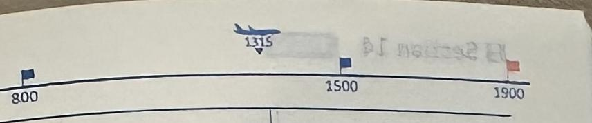

Section 14
動詞篇
suppress
[saprises]
□ □ 1308
deceive
[dist:v]
□□1309
manipulate
[monipjulett]
□□1310
starve
[sta:rv]
□□1311
flee
[fi:]
□□1312
whisper
[hwispər]
□□1313
yell
[jel]
□□1314
deposit
[dpá(:)zət]
□□1315
卷抑える；を抑圧する
suppression 圧圧, 镇压
the
□suppressive 圧圧する；抑制する
をだます(☆take in)
deceive ~ into doing ~をだまして~は
deceive oneself (自分に都合が
deception 感
□deceptive 頭欺瞞的な；当てに
□deceit 頭くこと
を(巧みに)操る；を改ざんする
manipulate
manipulate A into B A を操って B をさせる
manipulation 操作；改ざん
media manipulation (不正な) メディア操作
風える；(～を)渴望する(for)；を凱えさせる
starve to death「餓死する」
die of [from] starvation 餓死
(から)逃げる
flee to [from] ~ 「~へ[から]逃げる」
語源は古英語の fleon 「飛ぶ」。
活用：flee - fled - fled
(を)ささやく
whisper secrets in his ear 秘密を彼に耳打ちする
ささやき(声)；ひそひそ話
叫ぶ，となる
⑰ yell (out) at ~「~に叫ぶ，どなる」
大声の叫び，わめき
を置く；を預ける；を堆積させる
deposit valuables in ~ ~に貴重品を預ける
▶ 保証金；預金；堆積(物)
make a deposit in a bank 銀行に預金をする
□depósitório 保管場所，貯蔵所
350

The company tried to suppress the news story about their illegal deals.
He is the last man to deceive other people.
The politician knows how to manipulate public opinion.
The man did not starve to death while walking through desert to the city.
The woman tried to flee from the scene of the crime.
I whispered in her ear to keep silent.
The driver yelled at me to stay on the sidewalk.
She deposited a pile of documents on her desk and called me.
その会社は自社の不法取引に関するニュース記事を抑えようとした。
彼は一番他人をだましそうにがい人だ。
その政治家は世論を探る術を知っている。
その男性は砂漠を通って
町へ歩いて行く間，餓死
しなかった。
その女性は犯行現場から逃げようとした。
私は彼女の耳に黙っているようにさせいた。
運転手が私に歩道に留まるようにどなかった。
彼女は雪類の山を自分の机に置いて私を呼んだ。
351